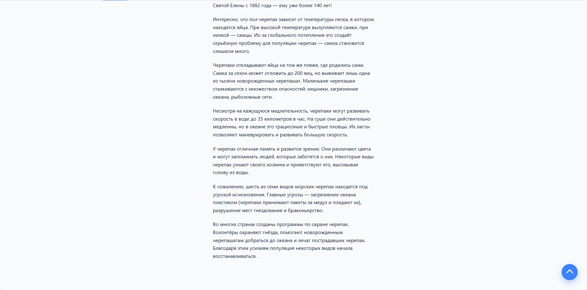
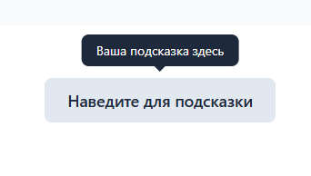
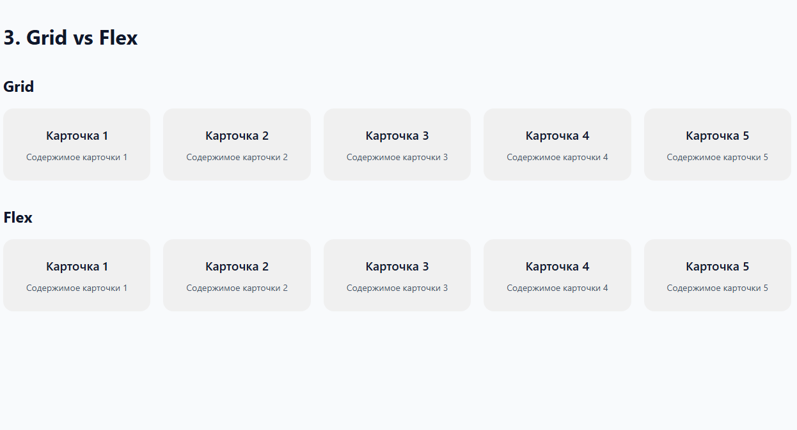
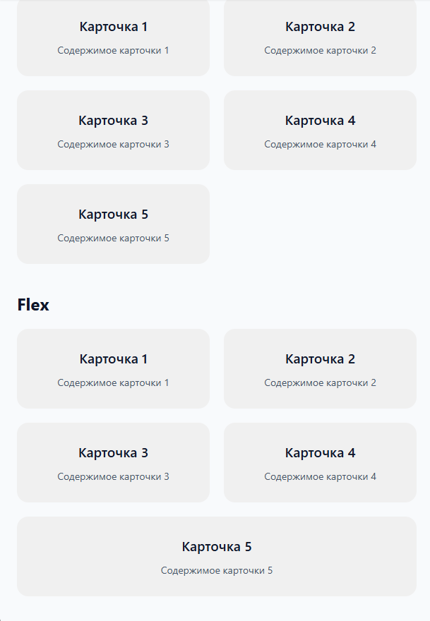
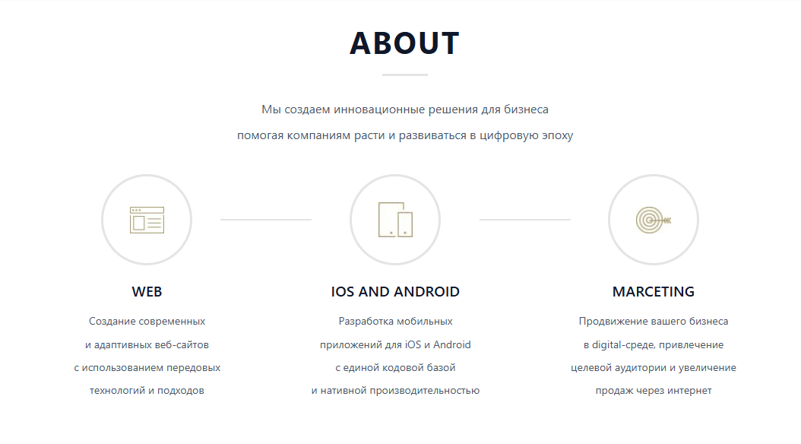

# Task 1

##  Демо и навигация

Приложение содержит 4 страницы, доступные через навигационное меню:

| Страница | Путь | Описание |
|----------|------|----------|
| Кнопка "Наверх" | `/button-up` | Плавающая кнопка с плавным скроллом наверх |
| Tooltip | `/tooltip` | Всплывающая подсказка при наведении |
| Grid vs Flex | `/grid-flex` | 5 карточек: Grid и Flex версии |
| О нас | `/about` | Страница по БЭМ-методологии |

## Задания

### 1. Кнопка "Наверх" (`/button-up`)

- Фиксированная кнопка в правом нижнем углу
- Появляется при скролле страницы вниз
- При нажатии — плавный скролл наверх
- При наведении — hover-эффект
- Стрелка реализована на чистом CSS



**Файлы реализации:**
- `shared/ui/Button/ButtonUp.tsx`
- `shared/ui/Button/ButtonUp.css`
- `widgets/ButtonUpWidget/ButtonUpWidget.tsx`
- `pages/ButtonUpPage/ButtonUpPage.tsx`

### 2. Tooltip (`/tooltip`)

- При наведении на элемент появляется всплывающая подсказка
- Плавная анимация появления/исчезновения
- Подсказка появляется сверху



**Файлы реализации:**
- `shared/ui/Tooltip/Tooltip.tsx`
- `shared/ui/Tooltip/Tooltip.css`
- `widgets/TooltipWidget/TooltipWidget.tsx`
- `widgets/TooltipWidget/TooltipWidget.css`
- `pages/TooltipPage/TooltipPage.tsx`

### 3. Grid vs Flex (`/grid-flex`)

- 5 карточек с заголовками
- Каждая карточка содержит описание
- Адаптация под любой размер экрана





**Файлы реализации:**
- `shared/ui/Card/Card.tsx`
- `shared/ui/Card/Card.css`
- `widgets/GridVsFlexWidget/GridVsFlexWidget.tsx`
- `widgets/GridVsFlexWidget/GridVsFlexWidget.css`
- `pages/GridVsFlexPage/GridVsFlexPage.tsx`

### 4. О нас — БЭМ (`/about`)



**Файлы реализации:**
- `shared/ui/CircleCard/CircleCard.tsx`
- `shared/ui/CircleCard/CircleCard.scss`
- `widgets/AboutWidget/AboutWidget.tsx`
- `widgets/AboutWidget/AboutWidget.scss`
- `pages/AboutPage/AboutPage.tsx`
- `shared/images/first.jpg`
- `shared/images/second.jpg`
- `shared/images/third.jpg`

## Установка и запуск

```bash
# Установка зависимостей
npm install

# Запуск dev-сервера
npm run dev

# Сборка проекта
npm run build

# Предпросмотр сборки
npm run preview